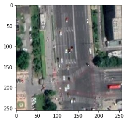
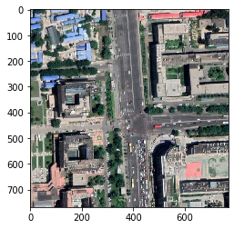
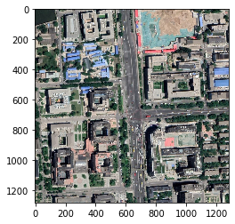

## MapTileToolKits

Map tile toolkits

- coordinate convert
- crawler
- map image concat

地图瓦片工具包 

- 坐标系转换
- 地图爬虫
- 地图拼接

```python
import mttk

import cv2
from matplotlib import pyplot as plt
```

### 1. Convert LatLng to Tile XY coordinate

- 将经纬度坐标转换为地图的xy坐标系


```python
tile = mttk.latlng2tile(39.9921774700,116.3155652800, zoom = 18)
print(f"x={tile.x}\ny={tile.y}\nzoom={tile.zoom}")
```

    x=215770
    y=99249
    zoom=18


### 2. Get Tile Images

- 获取瓦片图像


```python
img_tile = mttk.getImg(tile)
print(img_tile.shape)

plt.imshow(cv2.cvtColor(img_tile, cv2.COLOR_BGR2RGB))
```

    (256, 256, 3)

    <matplotlib.image.AxesImage at 0x7fdd7b1a81d0>




- Save Image


```python
mttk.saveImg(img_tile, 'img.png')
```

### 3. Get Neighbor Tile Images


- You can use this feature get images around the point you want. The point will be the center of the image if the zoom level is small enough and ring level is big.

- 获取瓦片的邻居节点，可以配置邻居层级(ring)
- 可以用这个功能，以目标点位为近似中心，获取瓦片图像，只要zoom层级较小且ring层级较大。


```python
img_neighbor = mttk.getNeighborImg(tile, ring=1)
print(img_neighbor.shape)
plt.imshow(cv2.cvtColor(img_neighbor, cv2.COLOR_BGR2RGB))
```

    (768, 768, 3)

    <matplotlib.image.AxesImage at 0x7fdd7acfc710>



```python
img_neighbor = mttk.getNeighborImg(tile, ring=2)
print(img_neighbor.shape)
plt.imshow(cv2.cvtColor(img_neighbor, cv2.COLOR_BGR2RGB))
```

    (1280, 1280, 3)

    <matplotlib.image.AxesImage at 0x7fdd792b5d68>



```python

```
